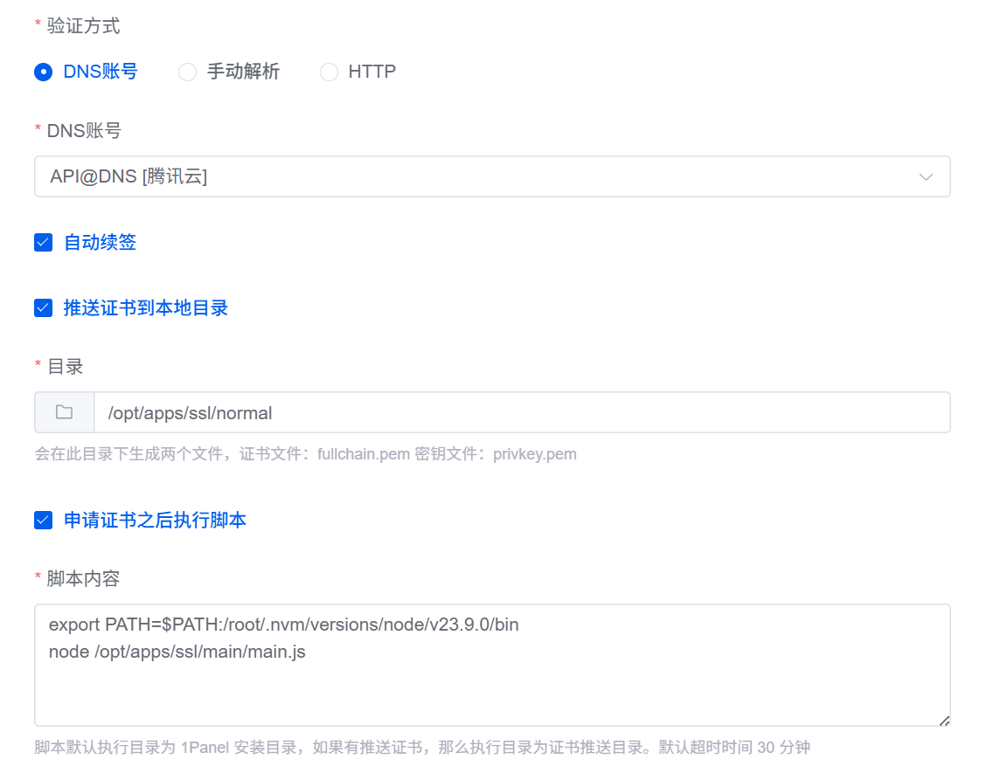

# tencentcloud-cdn-cert-manager

## 项目简介

> 本项目是一个基于 Node.js  的工具，旨在简化腾讯云 SSL 证书和 CDN 域名配置的管理。

**功能列表**

- **上传本地证书**：将本地 SSL 证书上传至腾讯云进行托管（禁用过期证书上传）。
- **更新 CDN 配置**：根据证书 CN 和 SAN，自动将托管证书应用到对应域名。
- **支持泛域名证书识别**：自动识别并更新所有符合层级的 CDN 域名。
- **清理旧证书**：自动识别并删除与当前证书 CN/SAN 相同的重复或过期旧证书。

**名词解释**

- CN（Common Name）—— 通用名称/主域名
- SAN（Subject Alternative Name）—— 主题备用名称/其它域名

**Let's Encrypt**

Let's Encrypt 是一家提供免费 SSL/TLS 证书的认证机构，支持包括泛域名证书在内的多种证书类型。其颁发的单张证书最多可包含 100 个 Subject Alternative Name（SAN）条目，可覆盖多个子域名或服务节点，非常适用于自动化部署及多域场景的安全通信需求。

## 处理流程



## 安装步骤

1. **克隆仓库**：
   ```bash
   git clone https://github.com/inkss/tencentcloud-cdn-cert-manager.git
   cd tencentcloud-cdn-cert-manager
   ```

2. **安装依赖**：
   确保已安装 Node.js（版本 ≥ 14.0.0），然后执行：
   ```bash
   npm install
   ```

## 使用指南

### 前期准备

**证书文件**

- 准备好 SSL 证书文件（`fullchain.pem`）和密钥文件（`privkey.pem`）。
- 可根据实际文件命名，手动修改 *main.js* 中的 `CERT` 与 `KEY` 定义。

**腾讯云密钥**

- 访问腾讯云控制台的 [API 密钥管理](https://console.cloud.tencent.com/cam/capi)页面，获取 `SecretId` 与 `SecretKey`。
- 确保当前账户拥有 SSL 与 CDN 管理权限。

### 配置环境变量

配置方式支持通过环境变量进行设置，变量命名需与 .env 文件中的格式保持一致。您也可以在项目根目录下创建一个 .env 文件，并填入以下内容：

```sh .env
TENCENT_SECRET_ID=您的 SecretId
TENCENT_SECRET_KEY=您的 SecretKey
```

### 运行脚本

1. **基本用法**：
   
   假设项目路径为：`/opt/apps/ssl/main/main.js`，证书文件存储路径为：`/opt/apps/ssl/normal/`。
   
   ```sh
   node /opt/apps/ssl/main/main.js /opt/apps/ssl/normal/
   ```
   - `./cert` 为包含 `fullchain.pem` 和 `privkey.pem` 的目录。
   - 未指定路径时，默认使用当前工作目录。


2. **配合 1Panel 使用**：
   
   - 启用【推送证书到本地目录】。
   - 启用【申请证书后执行脚本】，脚本示例：
     ```text
     node /opt/apps/tencentcloud-cdn-cert-manager/main.js
     ```
   - 1Panel 示例：  
     
3. **示例输出**：
   
   ```text
   证书解析成功：{
     主题：a.com
     可选名称：*.a.com,*.b.cn,*.v.6.c.net,a.com,b.cn
     指纹: 0F41DC439B85937289D4E28844F7EBB1C21D807B
     过期时间: Oct  9 14:09:56 2025 GMT
     剩余日期：89
   }
   找到匹配证书 - ID: PkSRMMyC
   域名 [a.com] 证书更新成功
   域名 [b.cn] 证书更新成功
   域名 [1.b.cn] 证书更新成功
   域名 [2.v.6.c.net] 证书更新成功
   域名 [3.b.cn] 证书更新成功
   域名 [4.b.cn] 证书更新成功
   当前证书有效至 2025-10-09 22:09:56，未发现需要删除的旧证书。
   ```

## 注意事项

- 证书解析并上传成功后，程序将根据证书中包含的 SAN 信息，自动更新对应 CDN 域名的 HTTPS 配置。
- 对于泛域名证书，即使部分域名当前使用的证书有效期更长，程序也会自动匹配并更新所有符合规则的加速域名。
- 请注意，程序在更新 CDN 配置时不会比较原证书与新证书的有效期差异，而是直接覆盖。
- 唯一值得欣慰的是（😀），在清理旧证书时，程序不会删除任何有效期晚于新证书的版本。
- 此外，为保证操作可控，程序仅处理来源为 *上传证书* 的证书记录。
